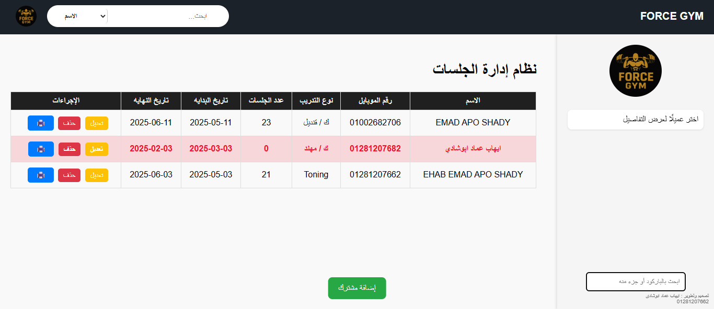

# 🏋️‍♂️ Gym Management System

نظام متكامل لإدارة الجيم يشمل تتبع المشتركين، الحصص التدريبية، المدربين، وخصومات الحصص عبر باركود أو Barcode .
## 📸 صورة من المشروع




## 🚀 الخصائص

- تسجيل وعرض المشتركين
- إنشاء وطباعة باركود أو  Barcode لكل لاعب
- خصم الحصص عند مسح الكود
- صفحة Dashboard تحتوي على إحصائيات عامة


## 🛠️ التقنيات المستخدمة

- Backend: Django 
- Frontend: HTML, CSS, JavaScript (Bootstrap)
- قاعدة البيانات: SQLite  
- توليد باركود: Pillow + python-barcode

## 🔧 طريقة التشغيل

```bash
# 1. كلون المشروع
git clone https://github.com/yourusername/gym-system.git
cd gym-system

# 2. أنشئ بيئة افتراضية وثبّت الحزم
python -m venv venv
source venv/bin/activate  # على ويندوز: venv\Scripts\activate
pip install -r requirements.txt

# 3. تشغيل قاعدة البيانات
python manage.py migrate

# 4. تشغيل السيرفر
python manage.py runserver
